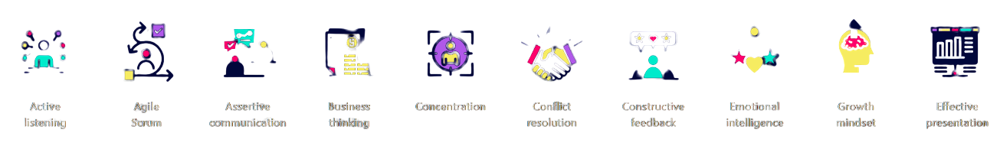

# Hi there 👋 I'm Loredana!

I am a junior Full Stack Developer.
Over the past year I worked in teams and also on solo projects and became comfortable working with Java, Spring Boot, Python, Javascript, React, CSS, Postgresql, Docker, Git and then some. 
 I developed a strong sense of algorithmic thinking, the OOP concepts and principles and always cared about having a clean code (easy to read == easy to maintain).
 My main projects are here, I will be happy to talk about them if given the chance.
I want to be honest, I still have technologies to learn and skills to master, one year of intense learning (mostly coding 6-8h/day), created my foundation for this career but my aim is high and I am eager to learn more.

## Skill set:

### :thinking: I want to learn:

- AngularJS
- Kotlin

## Soft Skill set:

